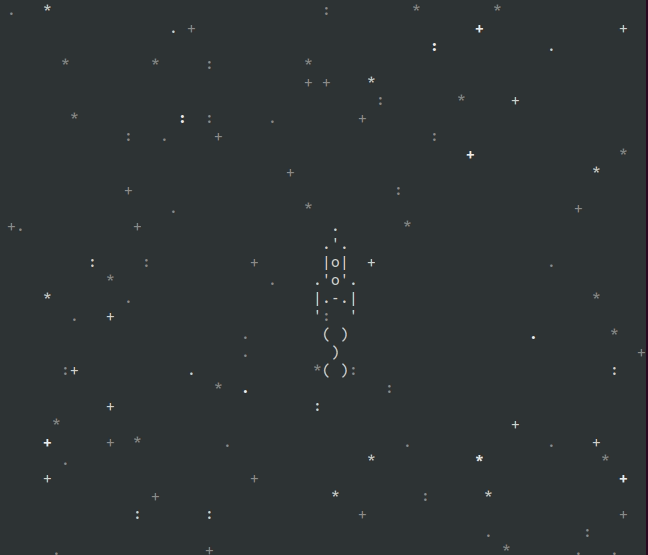

# Космическая игра.
Данный скрипт позволяет создать игру для управления космическим кораблем в терминале.
Ну или посмотреть демо: 

### Как установить
- [Python3](https://www.python.org/downloads/) должен быть уже установлен. 
- Установить [виртуальное окружение](https://python-scripts.com/virtualenv).

### Как запустить
1. Скачайте код
2. Установите зависимости командой:
```bash
pip install -r requirements.txt
```
3. Добавить название папки с файлами анимации.
```python
ANIMATIONS_FOLDER='тут путь до папки'
```
4. Запустите скрипт:
```bash
python3 space-game.py
```
